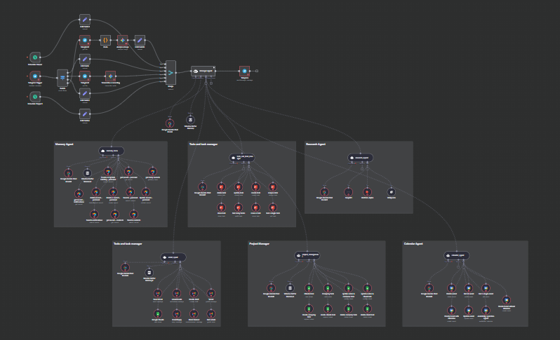

# N8N Multi-Agent Telegram Bot

[](https://github.com/AkilLabs/N8N-Multi-Agent-Telegram-Bot)

An intelligent multi-agent system built with N8N that provides a comprehensive personal assistant through Telegram. The bot manages calendar, tasks, emails, research, memory, and project management through specialized AI agents.

## 🔗 Official N8N Template
**N8N Workflow Template**: [https://n8n.io/workflows/8582-personal-assistant-bot-with-multi-agent-system-using-telegram-and-google-gemini/](https://n8n.io/workflows/8582-personal-assistant-bot-with-multi-agent-system-using-telegram-and-google-gemini/)

Get the official N8N workflow template to quickly deploy this multi-agent system in your N8N instance.

## 🏗️ Architecture Overview

**Main_agent.json** is the hierarchical top-level agent (the "Main Agent"). All other agents (Calendar, Email, Tasks, Memory, etc.) are added as sub-workflows (tools) to the Main Agent. This enables the Main Agent to route requests and delegate tasks to specialized sub-agents.

### Sub-Workflow (Sub-Agent) Structure

Each sub-agent (such as `Memory_agent.json`, `Project_management.json`, `Tasks_and_Todo_Agent.json`, etc.) is a self-contained workflow. These are imported into the Main Agent as tools using the `@n8n/n8n-nodes-langchain.toolWorkflow` node type.

#### Example: `Memory_agent.json` as a Sub-Workflow

- The `Memory_agent.json` workflow contains its own AI Agent node, Gemini node, and Airtable nodes for memory storage and retrieval.
- It is triggered by the `executeWorkflowTrigger` node when called as a tool from the Main Agent.
- All required credentials (e.g., Gemini API, Airtable API) must be configured in N8N and assigned to the relevant nodes in the sub-agent workflow.

#### How to Add Sub-Agents as Tools in the Main Agent

1. **Open `Main_agent.json` in N8N.**
2. Locate the **AI Agent node** (usually named `Manager Agent`).
3. For each sub-agent (e.g., Memory, Project Management, Tasks), add a **Tool** in the AI Agent node:
   - Use the `@n8n/n8n-nodes-langchain.toolWorkflow` node type.
   - Set the `workflowId` to the corresponding sub-agent workflow (e.g., `Memory_agent.json`).
   - Provide a clear `name` and `description` for each tool.
4. **Connect the tool nodes** to the AI Agent node as shown in the sample `Main_agent.json`.
5. **Configure required credentials** for each agent (Gemini, Airtable, SerpAPI, etc.) in the N8N credentials manager. Assign them to the relevant nodes in each sub-agent workflow.

See the `Main_agent.json` and sub-agent files (e.g., `Memory_agent.json`) for working examples of this hierarchical structure.

## 🚀 Quick Setup

### Option 1: N8N Cloud (Recommended for Beginners)

1. **Sign up at [n8n.cloud](https://n8n.cloud)**
   - Create a free account
   - Get instant access to N8N without installation
   - 5,000 workflow executions per month (free tier)

2. **Import the Workflows**
   - Download all `.json` files from this repository
   - In N8N Cloud: Go to **Workflows** → **Import from File**
   - Import each agent workflow individually

### Option 2: Local N8N Installation

#### Prerequisites
- Node.js 18.10 or higher
- npm or yarn

#### Installation
```bash
# Install N8N globally
npm install n8n -g

# Start N8N
n8n start

# Access at: http://localhost:5678
```

#### Alternative: Docker
```bash
# Run N8N with Docker
docker run -it --rm \
  --name n8n \
  -p 5678:5678 \
  -v ~/.n8n:/home/node/.n8n \
  n8nio/n8n
```

## 🤖 Project Overview

This multi-agent system creates "Jeni" - an AI assistant that manages your digital life through Telegram. The system consists of 9 specialized agents:

### Core Agents

| Agent | Purpose | Key Features |
|-------|---------|--------------|
| **Main Agent** | 🎯 Central coordinator | Routes requests, handles voice/text/images, personality |
| **Calendar Agent** | 📅 Schedule management | Google Calendar integration, event scheduling, reminders |
| **Tasks & Todo Agent** | ✅ Task management | Todoist integration, task creation/updates/completion |
| **Email Agent** | 📧 Email management | Gmail integration, compose/reply/organize emails |
| **Memory Agent** | 🧠 Information storage | Airtable database, contacts, notes, conversations |
| **Research Agent** | 🔍 Web research | SerpAPI, Wikipedia, Wolfram Alpha integration |
| **Project Management** | 📊 Team coordination | Project tracking, team follow-ups, progress analysis |
| **Schedule Agent** | ⏰ Reminder system | Time-based notifications and reminders |
| **Notify Memory** | 🔔 Notification handler | Manages alerts and important notifications |

### Key Capabilities

- **Natural Language Processing**: Understands voice messages, text, and images
- **Multi-modal Input**: Handles text, voice notes, and photos via Telegram
- **Smart Routing**: Automatically delegates tasks to appropriate specialist agents
- **Memory System**: Remembers contacts, preferences, and conversation history
- **Scheduled Actions**: Daily briefings and weekly team follow-ups
- **Calendar Integration**: Google Calendar management with smart scheduling
- **Task Management**: Todoist integration for comprehensive task tracking
- **Email Automation**: Gmail management with intelligent email composition
- **Web Research**: Real-time information gathering from multiple sources

## 🔧 Required Integrations

To fully utilize this system, you'll need to set up these services:

### Essential APIs
- **Gemini API**: Gemini models for AI processing
- **Telegram Bot Token**: Create via [@BotFather](https://t.me/botfather)
- **Google Calendar API**: Calendar management
- **Gmail API**: Email operations

### Optional Integrations
- **Todoist API**: Task management
- **Airtable API**: Memory and data storage
- **SerpAPI**: Web search capabilities
- **Wolfram Alpha API**: Mathematical and factual queries
- **Google Sheets API**: Spreadsheet operations

## 📱 Usage Examples

```
💬 "Schedule a meeting with John tomorrow at 2 PM"
→ Calendar Agent creates the event and sends confirmation

💬 "What are my tasks for today?"
→ Tasks Agent lists all pending items from Todoist

💬 "Research the latest AI developments"
→ Research Agent searches web and provides summary

💬 "Send email to client about project update"
→ Email Agent composes and sends professional email

💬 "Remember that John's birthday is next week"
→ Memory Agent stores personal information
```

## 🛠️ Setup Instructions

1. **Import Workflows**: Import all 9 JSON files into your N8N instance
2. **Configure Credentials**: Set up API keys for all required services
3. **Set Telegram Webhook**: Configure your bot token in Main Agent
4. **Test Connections**: Verify each agent works independently
5. **Start Main Workflow**: Activate the Main Agent to begin

## 🎯 Features

- **Conversational AI**: Natural personality with wit and proactivity
- **Multi-Agent Architecture**: Specialized agents for different domains
- **Cross-Platform Integration**: Connects 10+ different services
- **Automated Workflows**: Smart scheduling and follow-ups
- **Memory Persistence**: Remembers context across conversations
- **Error Handling**: Robust fallback mechanisms
- **Scalable Design**: Easy to add new agents and capabilities

## 📋 Daily Automation

The system automatically:
- Sends morning briefings with schedule, tasks, and news
- Provides weekly team progress reports
- Manages calendar conflicts and scheduling
- Organizes and prioritizes emails
- Tracks project milestones and deadlines

---

**Note**: This is a comprehensive personal assistant system. Start with basic agents and gradually add more complex integrations as needed.
